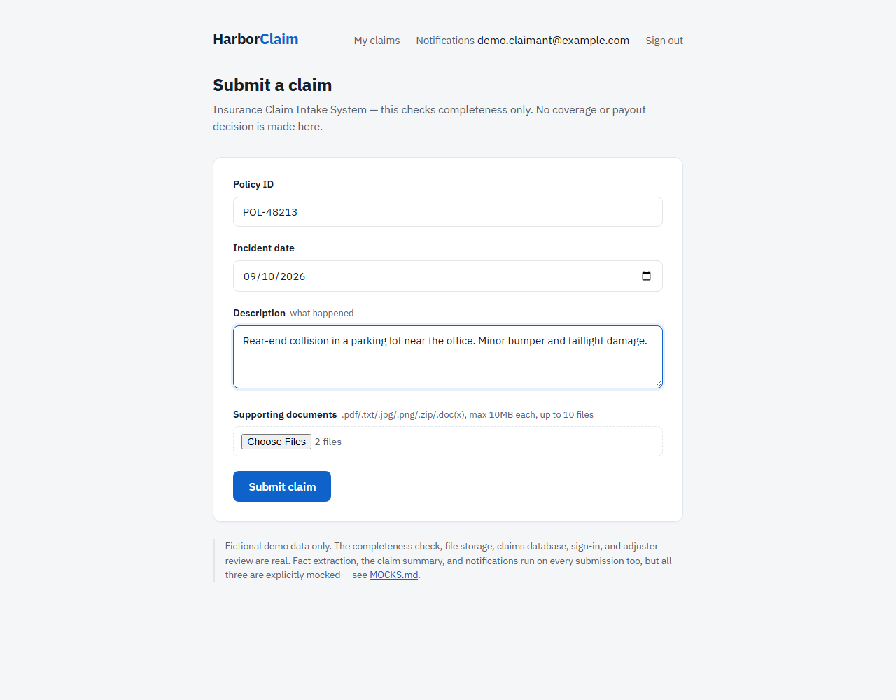
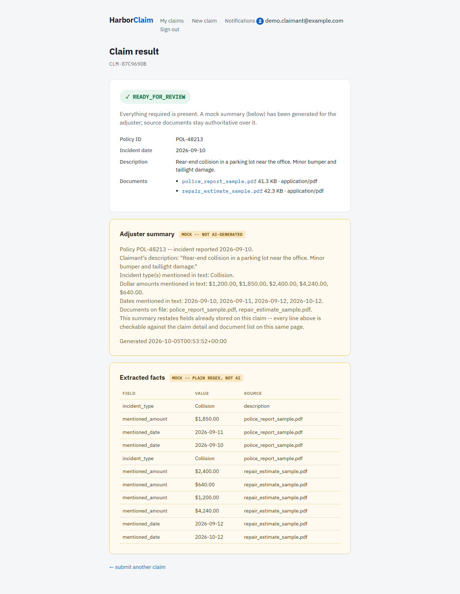
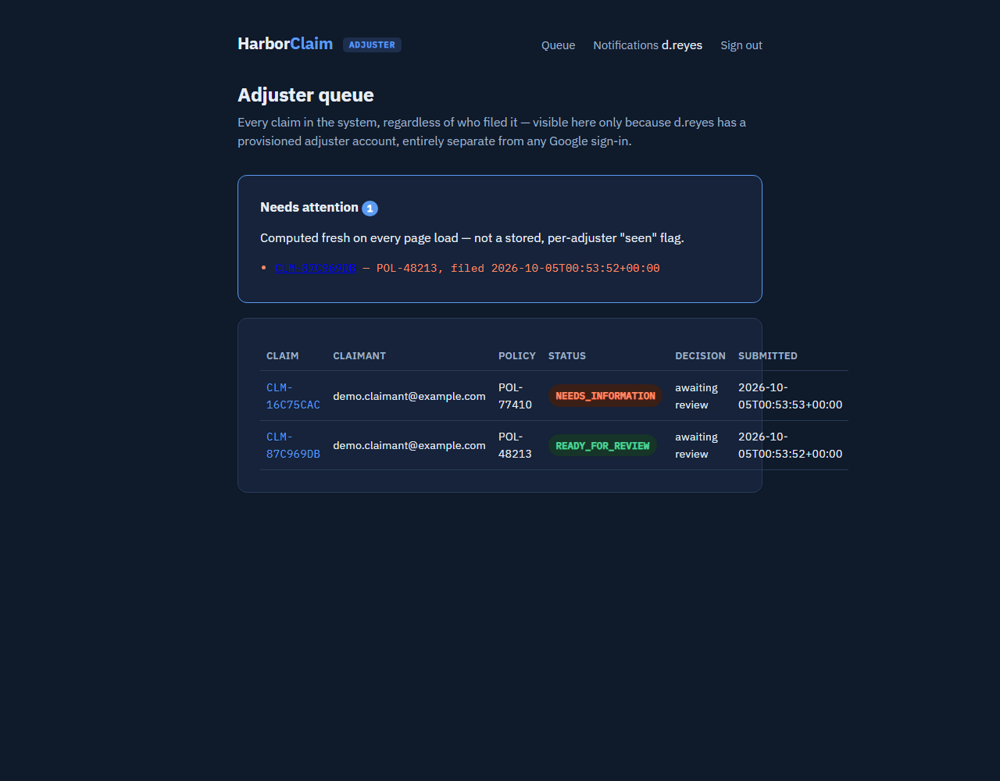
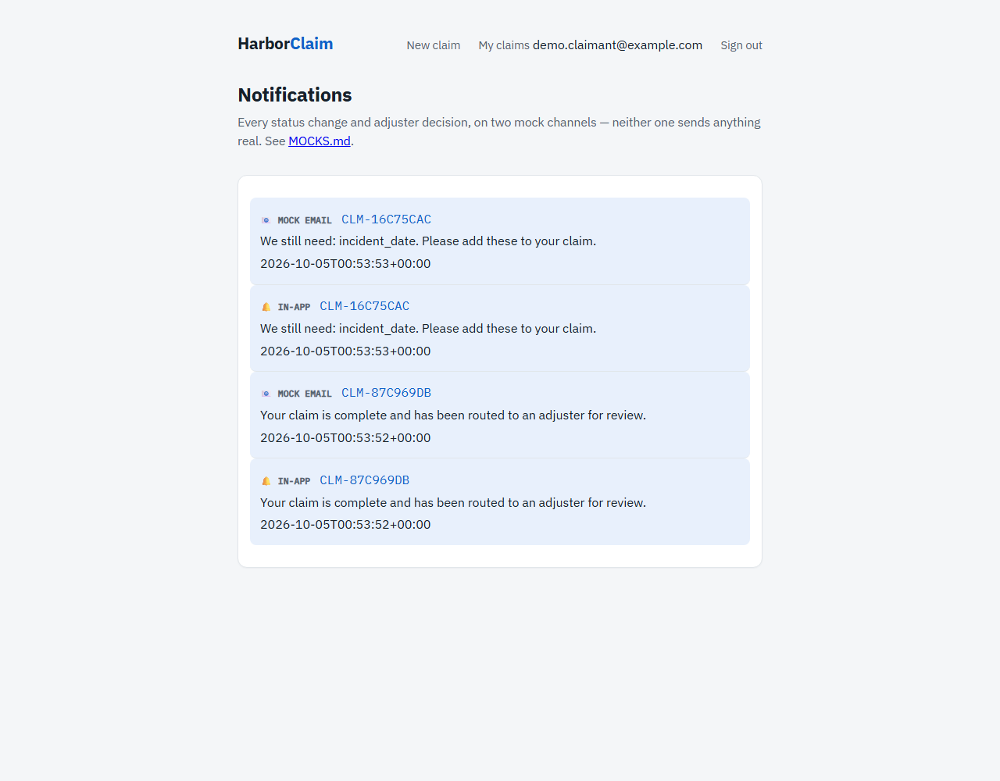

# HarborClaim — Insurance Claim Intake System

USF FIN 6934 (AI in Finance), System Design Studio — Assignment 7. HarborClaim is a
fictional insurtech startup; this is my take-home build for its claim intake system.

## Quick start (run the full web app)

The graded minimum (`main.py`) needs nothing but Python — see "Run it" below. This is
for the full app: real file storage, a database, sign-in, adjuster review, the mock
extraction/summary/notification pipeline.

```bash
# 1. Install dependencies into a venv
python -m venv .venv
.venv/Scripts/pip install -r requirements.txt      # Windows
# .venv/bin/pip install -r requirements.txt        # macOS/Linux

# 2. Set up login credentials
cp .env.example .env
# Claimant login needs a real Google OAuth app -- one-time setup, see
# "Accounts and privacy" below. Adjuster login needs none of that:
.venv/Scripts/python.exe -c "import storage; storage.init_db(); print(storage.create_adjuster('a.irving', 'Adjuster Name'))"
# ^ prints a password once -- copy it, you'll use it to sign in as that adjuster.

# 3. Run it
.venv/Scripts/python.exe -m uvicorn app:app --reload --port 8123
```

Open **<http://127.0.0.1:8123/>** — claimant sign-in is on that page; adjuster sign-in is
at **<http://127.0.0.1:8123/adjuster/login>** (the username/password from step 2). Try
uploading a file from `sample_data/` when filing a claim to see the mock extraction
pipeline find something real in it.

The port matters — `8123` has to match the redirect URI registered in Google Cloud
Console (see "Accounts and privacy" below) or claimant sign-in will fail with
`redirect_uri_mismatch`.

## What this is

The minimum working example from the take-home spec: a claim completeness checker.
Given a fictional claim (policy ID, incident date, description, and a list of
supporting documents), it returns `READY_FOR_REVIEW` if everything required is
present, or `NEEDS_INFORMATION` naming exactly which fields are missing.

**It does not approve, decline, or pay a claim.** That decision — and any judgment
about coverage — stays with a human adjuster. This component only decides whether a
claim has enough information to reach that adjuster in the first place.

## Setup

No dependencies — standard library only. Requires Python 3.9+.

## Run it

```bash
python main.py
```

```
[CLM-1001] READY_FOR_REVIEW
{
  "status": "READY_FOR_REVIEW",
  "missing": []
}

[CLM-1002] NEEDS_INFORMATION -- missing: incident_date
{
  "status": "NEEDS_INFORMATION",
  "missing": [
    "incident_date"
  ]
}
```

## Test it

```bash
python -m unittest -v
```

5 tests: a complete claim, a claim missing `incident_date`, a claim missing
`documents`, a claim missing everything (confirms all missing fields are named at
once, not just the first one found), and a check that the result never contains a
coverage/payout word (`approve`, `deny`, `decline`, `pay`).

## What counts as "required"

- `policy_id`, `incident_date`, `description` — must be present and a non-blank string.
- `documents` — must be present and a non-empty list. Contents aren't validated (a
  document's name alone doesn't say whether it's the *right* document — see Limitations).

## Limitations (on purpose, for this minimum version)

- Field values aren't validated beyond "non-blank" — an `incident_date` of `"tbd"`
  passes. Real date parsing / format checking is a natural next step.
- `documents` only checks the list isn't empty; it doesn't check that the *right*
  documents were uploaded for the claim type (e.g., a police report for an auto claim).
- No persistence — this is a pure function over one claim at a time, not a service.
- No AI extraction or summarization — the full design calls for an AI step that pulls
  structured facts out of uploaded documents and drafts an adjuster summary, but the
  scenario is explicit that source documents stay authoritative over any AI output.
  This minimum build implements the deterministic completeness gate that decision
  would sit behind, not the AI step itself.

## Mocks

All claim data (`CLM-1001`, `CLM-1002`, policy IDs, document names) is fictional,
written for this demo. No real customer or policy data is used anywhere in this
folder. (The web UI stretch below has three more mocked stages of its own — fact
extraction, summary generation, notifications — documented in full in `MOCKS.md`.)

---

## Optional stretch: web UI

Beyond the graded minimum above, this folder also has a small FastAPI web front end
(`app.py` + `templates/` + `static/`) so the completeness checker can be driven from a
browser instead of only the console demo. It's optional — the graded part is
`main.py`/`test_main.py` above, unchanged and untouched by any of this.

### Tech stack, and why

| Layer | What |
|---|---|
| Backend | FastAPI + Uvicorn |
| Templating | Jinja2 (server-rendered HTML, no JS framework) |
| Styling | Plain CSS (`static/style.css`), IBM Plex fonts |
| Testing | `pytest` + FastAPI's `TestClient` (`tests/test_app.py`) |
| State | SQLite (`storage.py`, `data/harborclaim.db`) — persists across restarts |
| Evidence storage | Uploaded files saved to `data/uploads/<claim_id>/`, standard library only |
| Auth (claimants) | Sign in with Google (`auth.py`, Authlib) |
| Auth (adjusters) | Provisioned username/password, `hashlib.scrypt`, standard library only — see "Accounts and privacy" below |

**FastAPI + Jinja2 was picked over Flutter Web or a NestJS backend for a few concrete
reasons, not just "it's what was already installed":**

- **Same language as the logic it's wrapping.** `app.py` imports `check_claim`
  directly from `main.py` — no network call, no serialization boundary, no second
  language. A Flutter or separate-Node front end would need the backend turned into a
  JSON API first (a fine change, just extra work with no functional benefit yet).
- **Zero new tooling, originally.** This started inside the course's shared Python
  environment, where FastAPI/Jinja2/Uvicorn were already installed from an earlier
  class's agent app — only `python-multipart` (form parsing) and `pytest` were new.
  Now split out into this standalone repo with its own `requirements.txt`.
- **It's the industry default for exactly this kind of AI-adjacent backend.** FastAPI
  is the framework used across most real-world "wrap model logic in an API" work
  (OpenAI's own examples, Hugging Face inference endpoints, LangServe, vLLM's serving
  layer) — precisely because Python is the AI ecosystem's language, so the API layer
  and the model/data code share one process and one language.
- **NestJS is a backend peer to FastAPI, not an alternative to Jinja2/Flutter** — same
  job (routing, validation, async I/O), different language (TypeScript vs. Python).
  Picking it here would mean rewriting `check_claim()` in TypeScript for no gain, since
  nothing in this project needs Node's ecosystem specifically.
- **Flutter is a frontend peer to Jinja2, not to FastAPI** — it's a UI toolkit (Dart),
  not a backend. Using it would mean keeping FastAPI underneath (converted to return
  JSON instead of HTML) and rebuilding the 3 screens in Dart on top. Reasonable if this
  becomes a real mobile+web app later; not needed to satisfy the assignment.
- **Scaling profile is the same as the alternatives that matter here.** FastAPI and
  NestJS are both async, stateless-by-default, and scale horizontally the same way
  (more processes/containers behind a load balancer) — nothing is given up by choosing
  Python over Node for this.

### Set up the web UI

```bash
python -m venv .venv
.venv/Scripts/pip install -r requirements.txt      # Windows
# .venv/bin/pip install -r requirements.txt        # macOS/Linux
```

If the project folder sits somewhere with a very long path (e.g. deep inside a
synced OneDrive folder), `pip install` can fail with a Windows "filename too
long" `OSError` on pip's own metadata files. If that happens, create the venv
somewhere short instead (e.g. `C:\hcvenv`) and just point at it with its full
path when running commands below — the interpreter doesn't need to live next
to the project.

### Accounts and privacy: two roles, two separate login mechanisms

Claimants and adjusters don't share a login screen — they're provisioned
completely differently, on purpose, because they're not the same kind of
account in the real world:

- **Claimants sign in with Google** (`/auth/login`, `auth.py`, Authlib). Signing
  in for the first time *creates* the account; there's no separate sign-up
  step (`storage.get_or_create_user`). Self-service is fine here because
  anyone can be a claimant. A claimant only ever sees their own claims —
  `/claims` is filtered to `claimant_email`, and `/claims/{id}` returns `403`
  for anyone else's claim.
- **Adjusters sign in with a username and password** at a completely separate
  page, `/adjuster/login` — no Google involved at all. Credentials are
  generated by `storage.create_adjuster(username, name)`, run by hand, never
  through any HTTP route. This mirrors how becoming an insurance adjuster
  actually works: most US states (Florida included, via its Department of
  Financial Services) require a real license before someone can hold the
  role, so self-service sign-up would be modeling something that isn't true.
  Passwords are salted and hashed with `hashlib.scrypt` (standard library) and
  checked with `hmac.compare_digest`; the plaintext password is returned
  exactly once, by `create_adjuster`, and never stored or logged again.

Both are still an authentication/authorization split even though the
mechanisms differ: signing in (either way) only ever proves *who* someone is.
*What* they're allowed to see is decided independently — a claimant's own
`claimant_email` on their claims, or simply the existence of a row in
`adjusters` for the other role. One browser can hold a claimant session and an
adjuster session at the same time (different keys in the same session
cookie), so a single person can file a claim and separately review others'
claims without signing out in between. Each side's logout route only ever
pops its own session key — a claimant signing out doesn't touch an
independent adjuster session sharing the same cookie, and vice versa.

### Separation of duties

`create_adjuster` takes an optional third argument, `linked_claimant_email`,
that records when an adjuster account and a claimant account belong to the
same real person (unusual in production, but true of our own test accounts).
When that link exists, `POST /claims/{id}/decision` refuses to let that
adjuster decide on a claim filed by that same email — a `403`, and the
decision buttons don't even render on the claim page. An adjuster account
with no linked claimant email is completely unaffected by this check; it only
ever fires on an exact match between `adjusters.linked_claimant_email` and
`claims.claimant_email`.

```bash
# An adjuster with no conflict of interest to worry about:
storage.create_adjuster("a.irving", "Adjuster Name")

# An adjuster who is also a claimant, so the conflict check applies:
storage.create_adjuster("a.irving", "Adjuster Name", linked_claimant_email="airving@gmail.com")
```

### Login audit trail

Every login and logout, on both sides, is appended to a `login_events` table
(`storage.record_login_event` / `storage.list_login_events`) — role
(`claimant`/`adjuster`), identifier (email or username), event
(`login`/`logout`), and a timestamp. It's a permanent record of activity, not
the session mechanism itself — the signed cookie still decides who's
currently logged in; this table exists so that activity can be reviewed after
the fact, the same reason `status_history` and `adjuster_decisions` are kept
as append-only tables instead of overwriting a single field. Query it with:

```bash
.venv/Scripts/python.exe -c "import storage; storage.init_db(); [print(e) for e in storage.list_login_events()]"
```

**Claimant login needs a real Google OAuth app** (Authlib needs a real client
ID/secret — there's no mock mode):

1. In [Google Cloud Console](https://console.cloud.google.com), create/select a
   project, then **APIs & Services → OAuth consent screen** → External, add
   scopes `openid`, `email`, `profile`, and add your own Google account under
   **Test users** (the app stays in testing mode, which is fine for this).
2. **APIs & Services → Credentials → Create Credentials → OAuth client ID** →
   **Web application**. Under **Authorized redirect URIs**, add exactly:
   `http://127.0.0.1:8123/auth/google/callback` (Google allows plain `http://`
   for `127.0.0.1`/`localhost`). This step is easy to think you did and
   actually skip — Google's downloaded client-secret JSON silently omits
   `redirect_uris` if it was never saved, which surfaces later as a very
   unhelpful `Error 400: redirect_uri_mismatch` on first login. Double-check
   it by re-opening the client in Cloud Console, not just by having clicked
   through the form once.
3. Copy `.env.example` to `.env` and fill in `GOOGLE_CLIENT_ID` and
   `GOOGLE_CLIENT_SECRET` from that client, plus any random string for
   `SESSION_SECRET_KEY` (`python -c "import secrets; print(secrets.token_hex(32))"`).

**Adjuster login needs no external setup at all** — provision an account by
hand whenever one's needed:

```bash
.venv/Scripts/python.exe -c "import storage; storage.init_db(); print(storage.create_adjuster('a.irving', 'Adjuster Name'))"
```

That prints the generated password once — copy it out and hand it to whoever
is signing in at `/adjuster/login`; there's no way to retrieve it again after
this (only its hash is kept), so if it's lost, provision a new account rather
than trying to recover the old password.

### Run the web UI

```bash
.venv/Scripts/python.exe -m uvicorn app:app --reload --port 8123
```

Then open `http://127.0.0.1:8123/`. The port matters here — it has to match
the redirect URI registered in Google Cloud Console above. `--reload` isn't
required, just convenient during development.

### Test the web UI

```bash
.venv/Scripts/python.exe -m pytest tests/test_app.py -v
```

38 tests. No real Google login is needed to run them — claimant login is faked
with FastAPI's `dependency_overrides` on `get_current_user`, the standard way
to test routes behind auth. Adjuster login is tested for real, not faked —
`storage.create_adjuster` generates a real account and the tests actually
`POST /adjuster/login` with the real password, so `storage.verify_adjuster`'s
hashing/comparison logic is genuinely exercised, not assumed. Covers
everything from the earlier count, plus: mock extraction actually finding
facts in a real uploaded `.txt` document, a mock summary being generated on
submission, notifications landing on both mock channels for a complete and
an incomplete submission, the notifications page listing and marking them
read, an adjuster decision notifying the claimant, the "needs attention"
panel excluding claims that already have a decision, an adjuster-only
session being refused the claimant claim page (and vice versa) even for the
exact same claim, no adjuster links appearing anywhere on a claimant page,
the adjuster notifications view, and malformed input (an oversized policy
ID, a future incident date, a disallowed file type, an oversized file) being
rejected with the form re-shown rather than silently stored.

### UI tests (real browser, run on demand)

`tests/test_app.py` checks HTTP responses in-process and never touches a real
browser — fast, but it can't catch a CSS rule that makes text unreadable or a
form that doesn't actually submit the way a user experiences it.
`tests/test_ui.py` does, using Playwright against a real, live `uvicorn`
process it starts and stops itself (port 8199, separate from your own dev
server on 8123). Not part of the regular test command — it needs a browser
binary installed and takes longer to run:

```bash
.venv/Scripts/python.exe -m playwright install chromium   # once
.venv/Scripts/python.exe -m pytest tests/test_ui.py -v
```

7 tests: the signed-out page, a full claimant submission with a real file
upload (checking the extraction/summary pipeline actually ran, not just that
the mock labels are present), the validation error state (visible, with
typed values preserved), a real adjuster login, strict page separation (an
adjuster-only session can never reach claimant content, verified by checking
the claim's own data never appears on whatever page results — not by
asserting an exact URL, since that redirect chain legitimately continues on
to a real Google OAuth hop, which the test blocks rather than depends on), a
full decision round-trip visible in the browser, and one regression test
worth calling out specifically: it measures the actual rendered WCAG
contrast ratio of the mock-card text against its background, rather than
relying on a human looking at a screenshot. That test is there because a
real bug slipped through exactly that way once already — the mock card's
fixed cream background combined with the adjuster dark theme's near-white
text color measured 1.13:1 contrast (confirmed by temporarily reverting the
fix and watching this exact test catch it) before being fixed to 4.5:1+.

Only claimant-related UI tests need `SESSION_SECRET_KEY` in `.env` (the same
signed-cookie technique the documentation screenshots use) — not real Google
OAuth credentials, so this suite runs even without ever completing the
Google Cloud Console setup.

### Screenshots

Captured from the actual running app (Playwright driving a real browser
against a live `uvicorn` process — claimant screens use an injected,
properly-signed session cookie rather than an interactive Google consent
screen, which can't be automated headlessly; adjuster screens use a real
form login). Full set in `docs/screenshots/`.

| | |
|---|---|
|  New claim form, two sample PDFs attached |  Result page — mock summary + extracted facts, clearly tagged |
|  Adjuster queue — "Needs attention" panel |  Notifications inbox — both mock channels |

### What's real vs. mocked

All seven Design Deliverable stages are wired into one pipeline now — see
`MOCKS.md` for exactly which three are deliberately fake and why:

| Stage | Status |
|---|---|
| Completeness check | ✅ Real (the graded minimum) |
| Document/evidence storage | ✅ Real — `storage.py` writes uploaded files to `data/uploads/<claim_id>/`, never touches their contents |
| Persistent claims database | ✅ Real — SQLite, survives a server restart (verified by actually restarting `uvicorn` mid-session) |
| Accounts | ✅ Real — Google sign-in for claimants, provisioned username/password for adjusters |
| Fact extraction | 🟡 **Mock** — real text read (via `pypdf`), fake intelligence (plain regex) — see `MOCKS.md` |
| Summary generation | 🟡 **Mock** — template-assembled from stored fields, no model call — see `MOCKS.md` |
| Adjuster review | ✅ Real — a human decision, gated by separation of duties |
| Notifications | 🟡 **Mock** — logged on two channels, nothing actually sent — see `MOCKS.md` |

One honest limitation worth naming: nothing in this app verifies that a
provisioned adjuster actually holds a real state adjuster license.
`create_adjuster` is a technical control (who can authenticate), not a
regulatory one (who is legally allowed to hold the role) — it assumes
whoever runs that command already checked. A real system would integrate
with a state licensing lookup before provisioning; that's out of scope here.

Try the pipeline yourself with `sample_data/` — four fictional claim
documents written so the mock extractor finds something real in them.

### Input validation and error handling

`validation.py` rejects malformed input before a claim is ever created —
separately from `main.py`'s completeness check, which only cares whether a
*complete* field is present, not whether a present one is well-formed. A
blank policy ID is `main.py`'s problem (`NEEDS_INFORMATION`); a 10,000-character
one, an incident date in the year 3026, or a `.exe` upload are
`validation.py`'s problem (`400`, form re-shown with the error and whatever
was typed still in place). Limits: policy ID ≤ 40 characters, description ≤
5,000 characters, incident date can't be in the future or before 2000, files
must be one of `.pdf .txt .jpg .jpeg .png .zip .doc .docx`, ≤ 10MB each, ≤
10 files per claim.

Separately, a global exception handler (`app.py`'s `unhandled_error`) catches
anything that isn't already a handled response and returns a generic `500`
page — the real error goes to the server console, never into the response
body, the same "no stack traces to the user" rule a classmate's submission
used for the same reason.

### Claimant and adjuster pages are fully separate routes

Not just hidden behind role checks — there is no template and no URL that
renders differently depending on who's looking at it. Every claimant route
lives under `/`, `/claims`, `/notifications`; every adjuster route lives
under `/adjuster/...` (`/adjuster`, `/adjuster/claims/{id}`,
`/adjuster/notifications`). A claimant session grants zero access to any
`/adjuster/...` route, and an adjuster session grants zero access to
`/claims/{id}` — even for the exact same claim, even though both of those
used to be one shared page (`result.html`) with role-conditional sections.
The adjuster side also gets its own visual theme (dark navy, redefining the
same CSS custom properties the claimant side uses, so every existing
component re-skins itself with no duplicated rules) specifically so the two
never look alike even at a glance. The one exception is the signed-out
landing page (`/`) and `/adjuster/login` — both are pre-login screens with no
account data on them at all, so offering both sign-in paths from each isn't
sharing anything.
